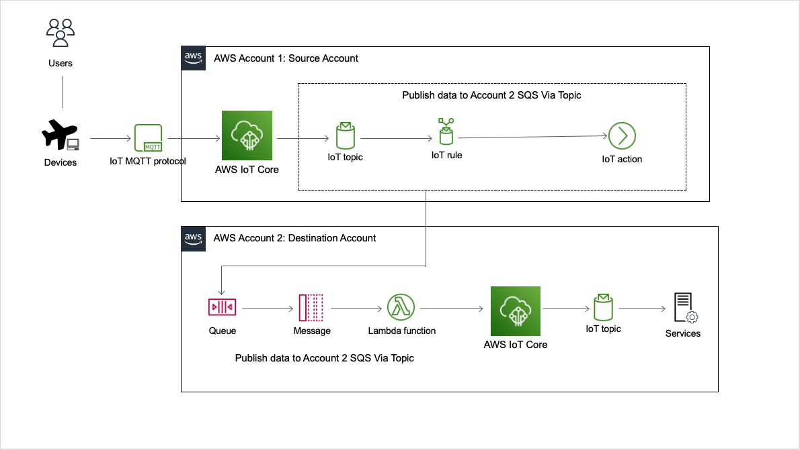
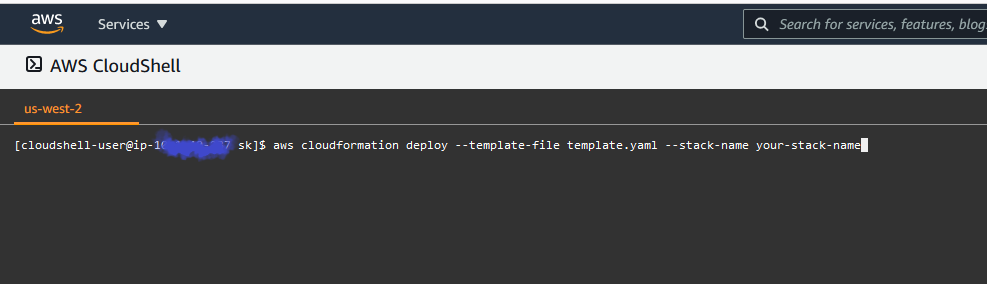
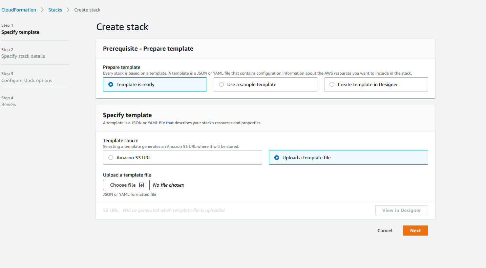
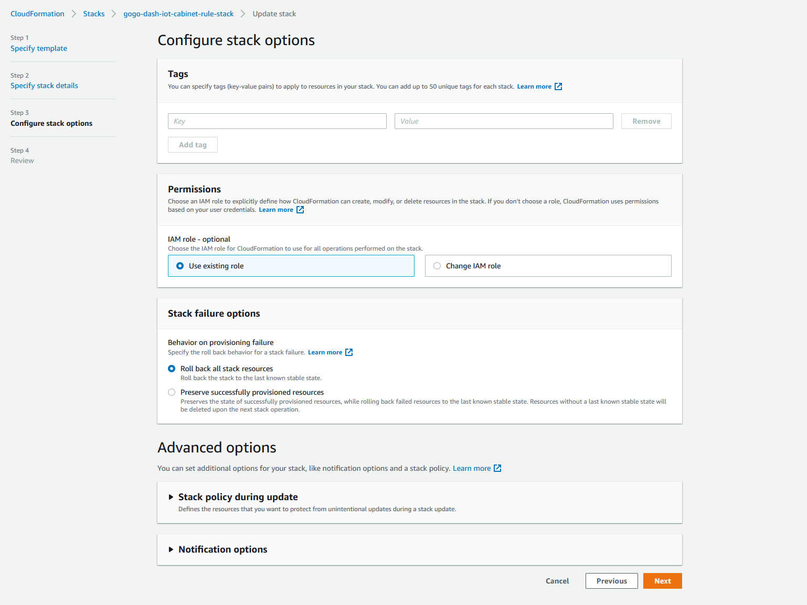
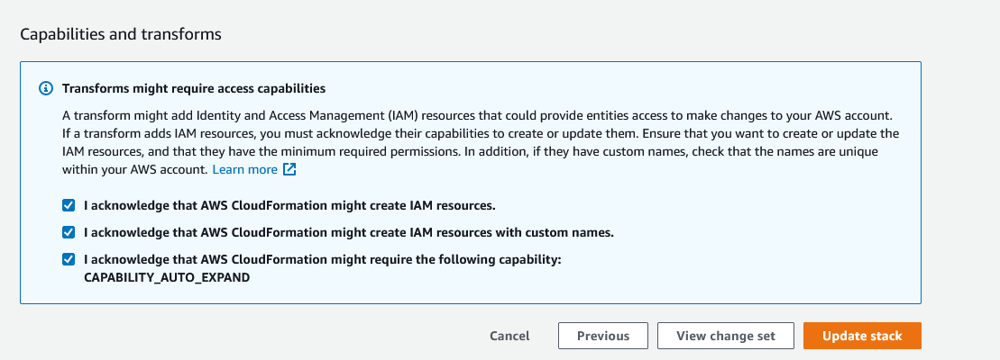
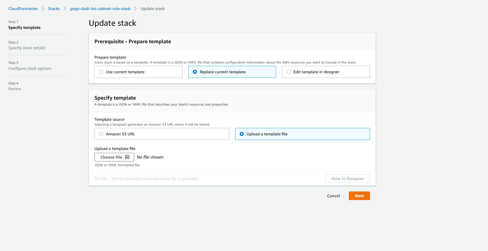

**Publish MQTT AWS IoT Core Messages Across Accounts**

**Introduction**

AWS IoT Core lets you connect billions of IoT devices and route trillions of messages to AWS services without managing infrastructure.

This sample project provides solution to publish MQTT messages that arrive to IoT topics from different IoT devices in one aws account to corresponding IoT topic in another aws account. Registered devices in one account can publish messages to IoT topics and messages will be seamlessly republished via infrastructure to IoT endpoint in another account. 

**Prerequisites:**

To complete this project you need the following prerequisites :

1. Two AWS accounts. 
    ex: acct1 : Source account and acct2 : Destination account

2. IAM Role for the user in both accounts with administrator full access IAM managed policy
       or with the appropriate policies and/or permissions to execute cloud formation templates.

**Architechture**

 

 
**Resources :**

- There are two AWS serverless SAM cloud formation templates included in the source folder. 

- One for each aws accounts. 

   1. Acct1 , which is source account where MQTT messages will be published via devices to the IoT topics. 

   2. Acct2, destination aws account where messsages from source account will be published to corresponding IoT topics via IoT rules , 
      SQS and Lambda.

Given below are the details about the aws resources created in the source and destination stack by each one of the CFTs. 

 **File name : acct2-destination-iot-environment.yaml**

  1. 	Acct2 cloud formation template defines infrastructure needed in Destination account. 

  2. 	Destination environment where IoT messages need to be republished is 
      defined as serverless SAM template. 

  3.	Standard SQS Queue with related IAM policy is defined in the template. 
  4.	Policy for Queue is defined to address cross account permissions to send 
      messages to queue.

  5.	Lambda function with related execution policy is defined. 
  6.	Lambda is subscribed to queue as a listner. Once messages arrive to queue 
      existing  in BA account from CA account ,
  7.  Lambda will read the corresponding message and republish to the given IoT topic 
     in BA account. 

  8.	From here on messages are available in BA account in IoT topic for further 
  processing, for example backend services can subscribe to topic to process messages further or an IoT rule can be defined again in account with 
  related action attached to rule to store messages in S3 bucket in 
  destination account. 

  9.  Lambda function has logic to parse payload to fetch appropriate topic in 
  destination where message needs to be posted and publishes message to 
  corresponding IoT topic in cross environment. 

**File name : acct1-source-iot-environment.yaml**

  1.  Acc1 cloud formation template defines infrastructure needed in source account. 

  2.  Source environment where IoT messages need to be republished from is
  defined as serverless SAM template. 

  3.  AWS IoT rule is defined in template with related action to publish mqtt 
  message to cross account queue. Rule has attached sql to filter message 
  data from specific topic. 

  4.  IoT rule has logic to get source topic name in sql. message will be 
  republished to corresponding topic in destination account.
    
  5.  IAM role for the IoT rule is defined which gives cross account permissions to IoT rule to send messages to the queue in destination environment.

**Getting Started: Creating the stack via CFTs** 
 

   1. We will set up an application stack in both the aws accounts by executing CFTs.

   2. Templates should be executed in order i.e. destination account template should be executed first as SQS resource 
      will be created through this template. 

   3. Source aws account Id , destination aws account Id and destination IoT end point URL are needed to deploy IOT rules in source aws account. 

   4. CFTs can be executed via AWS CLI or from Cloud Formation Service in AWS console.
      Detailed screen shots are included for both the approaches with step by step details. 

**Execution Steps : We are now ready to deploy CFTs**

1. 	Run destination environment CFT first
(acct2-destination-iot-environment. yaml).

   - Make sure to replace parameters in CFT with appropriate account 
     numbers and IoT endpoint URL  in lambda function. 

   -	Once stack is created in destination environment, make a note of queue 
      ARN and queue URL. 

2. Run source environment CFT after replacing parameters in template with appropriate values i.e. account numbers, queue ARN, queue URL etc. 

**Procedure to Execute Cloud Formation Templates**

1. **Via AWS CLI**

 

2. **Via AWS Console**

- Login to AWS Management console and navigate to cloud Formation service.  
  We can upload cloud formation template from your local or from desingnated S3 folder to deploy your stack. 

  Below are the steps to be followed to deploy stack via console. 

   

   

   

Cloud Formation stack can also be updated with new version of CFT via console.

   

**Testing :**

1. Given below are the sample messages that can be posted to IoT topic in source aws account and same message can be verified in destination aws account by subscribing to the same topic. 

      Sample Message that can be posted to source IoT topic(‘YourTopicName') for testing:

      {
      "message" : "IoT message from  account1"
      }

2. Subscribe to ‘YourTopicName' via MQTT test client on AWS console in destination account and verify 
that the above message gets delivered. 

3. Check CloudWatch logs for the corresponding lambda to see the debug logs to 
   verify topic name and actual message. 

      {
      "message" : " IoT message from  account1",
      "topic" : " YourTopicName'"
      }

**Understanding What Happened**

AWS IoT Core Rule that is set up in source account has action defined to deliver arrived messages to SQS queue. Queue is created in destination account. Once message arrives in the Queue a lambda function execution is triggered. Lambda function is defined as a listener to the queue. Lambda function has logic to determine name of the source topic where message was posted in source account and republish the same message to similar topic in destination account. 

**Clean Up**

After you are done walking through this project, you will have multiple aws resources created in both source and destination aws accounts.  Easy way to delete these resources is to invoke delete stack via aws console for the corresponding stack that was created via template execution in order to avoid incurring any further charges.
 
 

**Additional Resources**

https://docs.aws.amazon.com/iot/latest/developerguide/what-is-aws-iot.html

https://docs.aws.amazon.com/iot/latest/developerguide/iot-rules.html

